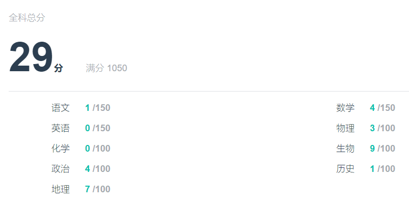
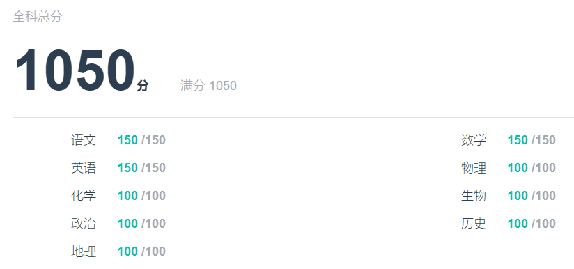
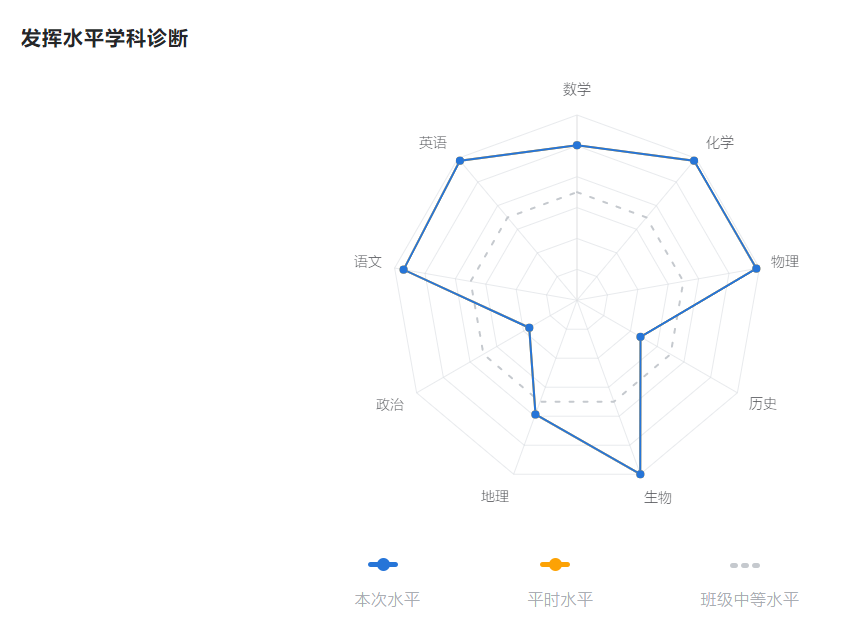
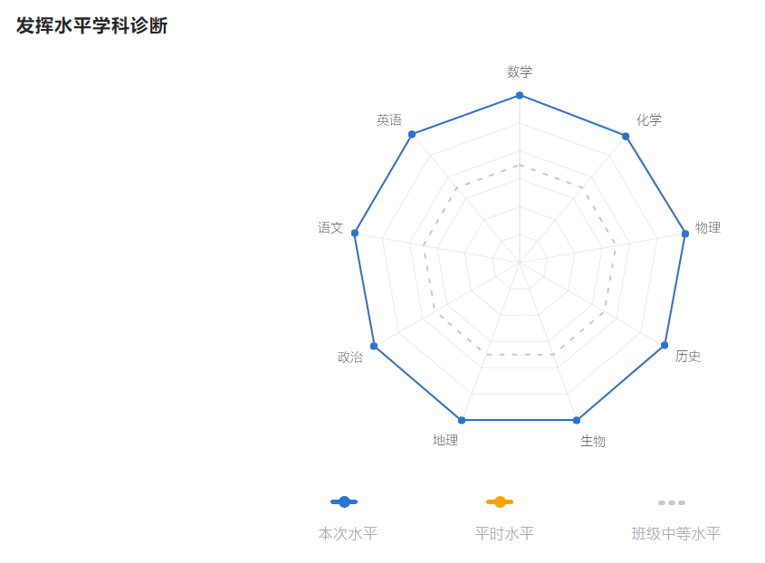
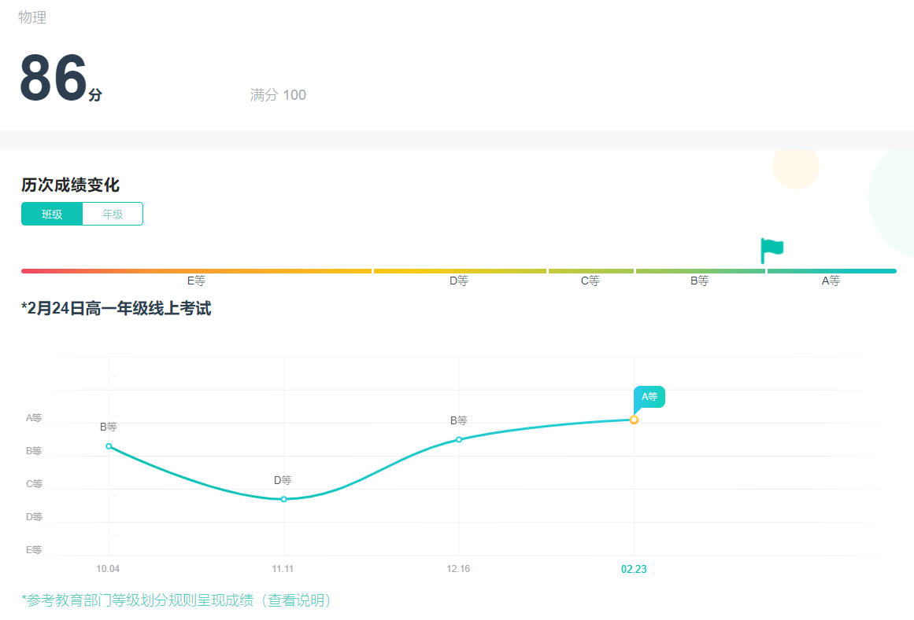
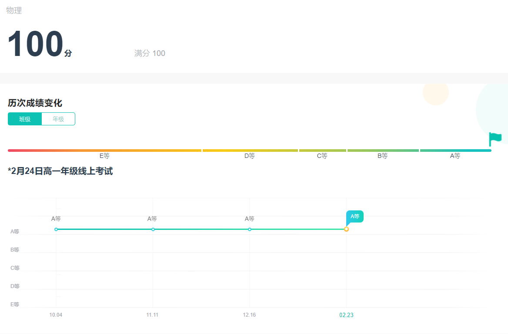
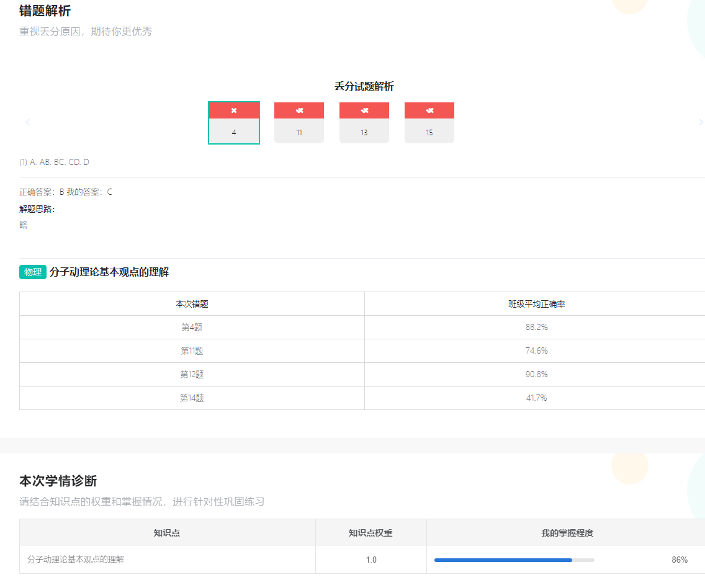

# ZhixuewangScoreExt (ZhixuewangScoreExtension)

  
## **如有不更改或新内容请提issues or prs, thanks~**
- 用于在智学网成绩报告页面以及考试原卷页面快速更改为满分的插件
## 如何使用？
- 从[**Releases**](https://github.com/aquamarine5/ZhixuewangScoreExt/releases)处下载最新插件的zip包
- 解压，打开Edge ( edge://extensions/ ) 或Chrome ( chrome://extensions/ ) 扩展页面
- 在右下角打开**开发人员模式**
- 点击**加载解压缩的扩展**，选择解压后的文件夹根目录，点击确定
- 刷新智学网网页，点击地址栏右侧的扩展图标即可使用
## 免责声明
使用此插件带来的老师批评学生质疑等作者均不负责
## 效果实例
### 修改分数为满分
> 修改前：
> 

> 修改后：
> 
### 修改全科分析图为九边型战士
> 修改前：
> 

> 修改后：
> 
### 修改历史成绩曲线为平衡木
> 修改前：
> 

> 修改后：
> 
### 修改错题分析为全对
> 修改前：
> 

> 修改后：  
> 
